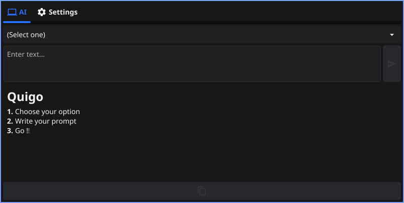
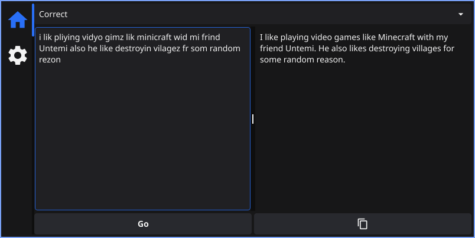
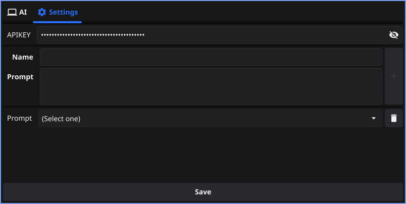

# Quigo   

A simple Google Gemini prompt saver made using Go and [fyne](https://github.com/fyne-io/fyne/).

## Why does this exist ?

Well, it's just not efficient copying those long prompts every time from that text file to get an acceptable response from an AI. This app started as a CLI since it was so fast and efficient, being able to just copy and get an instant response, but my friends wanted a GUI interface since not everyone uses a tiling window manager.

> [!NOTE]
> The CLI version will be ready soon.

### Screenshots





## Install :

> [!IMPORTANT]
> You will need to get an API key from [aistudio](https://aistudio.google.com/app/apikey)

> [!NOTE]
> You may want to hold on until I figure out how to setupe GitHub releases using GitHub actions, the current ones are released manually.

#### Window :

Just run the release executable.

#### Linux :

1. Download the the release tarball
2. Make a folder for the archive
3. Extract it using: `tar xf  quigo-gui-linux-x86-64.tar.xz -C path/to/folder`
4. `cd` to the folder
5. `sudo make install` for system-wide `make user-install` for user (~/.local/bin/)
   > To uninstall just go to the same folder and run `sudo make uninstall` or `user-uninstall` for user intall

## Build from source :

> You need a to have `GOPATH` added to `PATH`

```
$ git clone https://github.com/andro404-MC/quigo-gui
$ cd quigo-gui

// Run
$ go run .

// Build
$ go Build .
```

## Todo :

- Provide a way to add/remove prompts.
