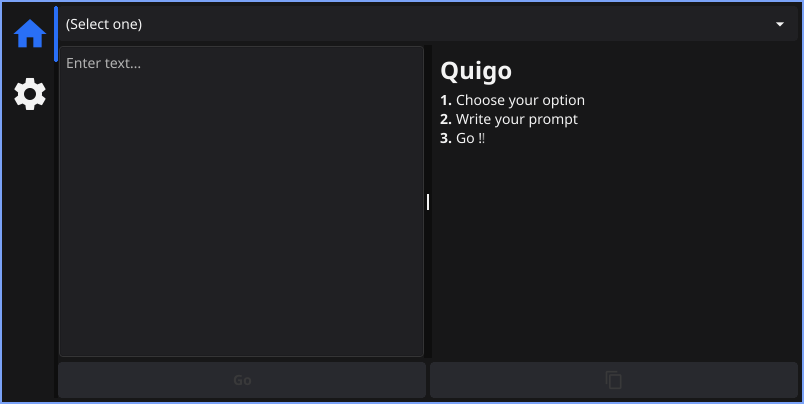
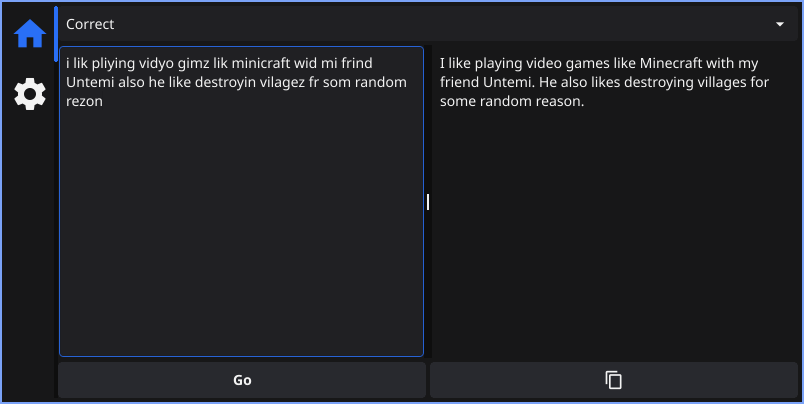

# Quigo-gui

A simple Google Gemini prompter made with [fyne](https://github.com/fyne-io/fyne/) and the Power of Go.

<p align="center">
  
    <br />
  
</p>

### Screenshots




## Build :

> You need a to have `GOPATH` added to `PATH`

```
$ git clone https://github.com/andro404-MC/quigo-gui
$ cd quigo-gui

// Run
$ go run .

// Build
$ go Build .

// Install
$ go install .
```

## Usage :

If the path is set up correctly, you can just run:

```
$ quigo-gui
```

> [!NOTE]
> You need to get an API key from [aistudio](https://aistudio.google.com/app/apikey)

## Todo :

- Provide a way to add/remove prompts.
